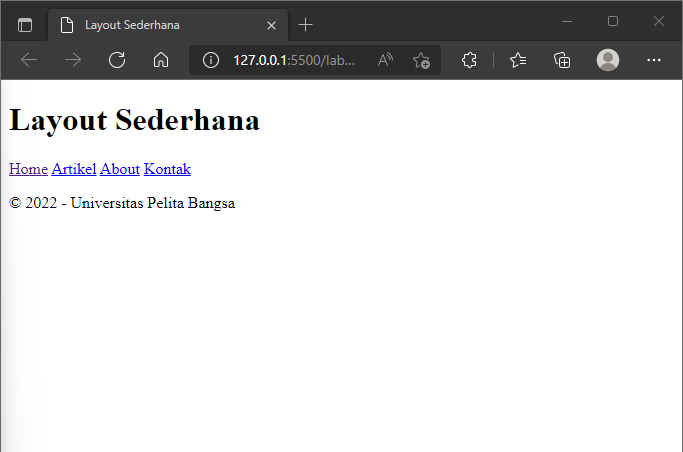

# Praktikum 4

## Profil
| | Biodata |
| -------- | --- |
| **Nama** | Humam Fathurrahman |
| **NIM** | 312010389 |
| **Kelas** | TI.20.A2 |
| **Mata Kuliah** | Pemrograman Web |

## 1. Membuat dokumen HTML

Membuat dokumen HTML dengan nama file **lab4_box.html** seperti berikut.

```html
<!DOCTYPE html>
<html lang="en">
<head>
    <meta charset="UTF-8">
    <meta http-equiv="X-UA-Compatible" content="IE=edge">
    <meta name="viewport" content="width=device-width, initial-scale=1.0">
    <title>Box Element</title>
</head>
<body>
    <header>
        <h1>Box Element</h1>
    </header>
</body>
</html>
```

## 2. Membuat Box Element

Tambahkan kode untuk membuat box element dengan tag ```<div>``` .

```html
<section>
    <div class="div1">Div 1</div>
    <div class="div2">Div 2</div>
    <div class="div3">Div 3</div>
</section>
```

Tambahkan deklarasi CSS pada head untuk membuat float element.

```css
<style>
    div {
        float: left;
        padding: 10px;
    }
    .div1 {
        background: blue;
    }
    .div2 {
        background: brown;
    }
    .div3 {
        background: green;
    }
</style>
```

Berikut tampilan hasilnya.


## 3. Mengatur Clerafix Element

**Clearfix** digunakan untuk mengatur element setelah float element. Property ```clear``` digunakan untuk mengaturnya.

Tambahkan element div lainnya seperti berikut.

```html
<section>
    <div class="div4">Div 4</div>
</section>
```

Kemudian tambahkan property clear dan float pada CSS.

```css
.div4 {
    background: aqua;
    clear: left;
    float: none;
}
```

Berikut tampilannya. 


Saya melakukan perubahan pada property ```clear``` menjadi seperti berikut.


Pada gambar diatas saya mengganti property ```clear: left;``` menjadi ```clear: right;``` .

## 4. Membuat Layout Sederhana

Buat folder baru dengan nama **lab4_layout**, lalu buatlah file dengan nama **home.html** dan file CSS dengan nama **style.css**


Kemudian tulis kode di dokumen **html** untuk membuat layout dengan semantics element seperti berikut.

```html
<!DOCTYPE html>
<html lang="en">
<head>
    <meta charset="UTF-8">
    <meta http-equiv="X-UA-Compatible" content="IE=edge">
    <meta name="viewport" content="width=device-width, initial-scale=1.0">
    <title>Layout Sederhana</title>
    <link rel="stylesheet" href="style.css">
</head>
<body>
    <div id="container">
        <header>
            <h1>Layout Sederhana</h1>
        </header>
        <nav>
            <a href="home.html" class="active">Home</a>
            <a href="artikel.html">Artikel</a>
            <a href="about.html">About</a>
            <a href="kontak.html">Kontak</a>
        </nav>
        <section id="hero"></section>
        <section id="wrapper">
            <section id="main"></section>
            <aside id="sidebar"></aside>
        </section>
        <footer>
            <p>&copy; 2022 - Universitas Pelita Bangsa</p>
        </footer>
    </div>
</body>
</html>
```

Tampilannya seperti berikut.



Kemudian tulis kode di dokumen CSS untuk menambahkan style atau gaya dan mengatur layout.

```css
/* import google font */
@import
url('https://fonts.googleapis.com/css2?family=Open+Sans:ital,wght@0,300;0,400;0,600;0,700;0,800;1,300;1,400;1,600;1,700;1,800&display=swap');
@import
url('https://fonts.googleapis.com/css2?family=Open+Sans+Condensed:ital,wght@0,300;0,700;1,300&display=swap');

/* Reset CSS */
* {
    margin: 0;
    padding: 0;
}

body {
    line-height:1;
    font-size:100%;
    font-family:'Open Sans', sans-serif;
    color:#5a5a5a;
}

#container {
    width: 980px;
    margin: 0 auto;
    box-shadow: 0 0 1em #cccccc;
}

/* header */
header {
    padding: 20px;
}

header h1 {
    margin: 20px 10px;
    color: #b5b5b5;
}
```

Tampilannya seperti berikut.


## 5. Membuat Navigasi

Selanjutnya tambahkan navigasi pada dokumen CSS seperti berikut.

```css
/* navigasi */
nav {
    display: block;
    background-color: #1f5faa;
}

nav a {
    padding: 15px 30px;
    display: inline-block;
    color: white;
    font-size: 14px;
    text-decoration: none;
    font-weight: bold;
}

nav a.active, nav a:hover {
    background-color: #2b83ea;
}
```

Tampilannya seperti berikut.


## 6. Membuat Hero Panel

Selanjutnya membuat hero panel pada *section* dengan id **hero** , tambahkan kode HTML dan CSS seperti berikut.

```html
<section id="hero">
    <h1>Hello World</h1>
    <p>Lorem ipsum dolor sit amet, consectetur adipisicing elit. Maxime laudantium harum optio molestiae quisquam, voluptates saepe deserunt, nam quas suscipit iure, a magni nihil cum temporibus earum? Aspernatur, iste cum?</p>
    <a href="home.html" class="btn btn-large">Learn more &raquo;</a>
</section>
```

```css
/* Hero Panel */
#hero {
    background-color: #e4e4e5;
    padding: 50px 20px;
    margin-bottom: 20px;
}

#hero h1 {
    margin-bottom: 20px;
    font-size: 35px;
}

#hero p {
    margin-bottom: 20px;
    font-size: 18px;
    line-height: 25px;
}
```

Tampilannya seperti berikut.


## 7. Mengatur Layout Main dan Sidebar

Selanjutnya mengatur main content dan sidebar, tambahkan CSS float.

```css
/* main content */
#wrapper {
    margin: 0;
}

#main {
    float: left;
    width: 640px;
    padding: 20px;
}

/* sidebar area */
#sidebar {
    float: left;
    width: 260px;
    padding: 20px;
}
```

## 8. Membuat Sidebar Widget

Kemudian menambahkan element lain dalam id sidebar di dokumen HTML.

```html
<aside id="sidebar">
    <div class="widget-box">
        <h3 class="title">Widget Header</h3>
        <ul>
            <li><a href="#">Widget Link</a></li>
            <li><a href="#">Widget Link</a></li>
            <li><a href="#">Widget Link</a></li>
            <li><a href="#">Widget Link</a></li>
            <li><a href="#">Widget Link</a></li>
        </ul>
    </div>
    <div class="widget-box">
        <h3 class="title">Widget Text</h3>
        <p>Lorem ipsum dolor sit amet consectetur, adipisicing elit. Rem totam explicabo cumque. Doloremque minus vel nesciunt fugiat cumque ipsam assumenda, rem odio! Deleniti, obcaecati voluptatum?</p>
    </div>
</aside>
```

Kemudian tambahkan CSS.

```css
/* widget */
.widget-box {
    border: 1px solid white;
    margin-bottom: 20px;
}

.widget-box .title {
    padding: 10px 16px;
    background-color: #428bca;
    color: white;
}

.widget-box ul {
    list-style-type: none;
}

.widget-box lil {
    border-bottom: 1px solid white;
}

.widget-box li a {
    padding: 10px 16px;
    color: #333;
    display: block;
    text-decoration: none;
}

.widget-box li:hover a {
    background-color: #eee;
}

.widget-box p {
    padding: 15px;
    line-height: 25px;
}
```

Tampilannya seperti berikut. 


## 9. Mengatur Footer

Selanjutnya mengatur tampilan footer. Tambahkan di CSS untuk footer.

```css
/* footer */
footer {
    clear: both;
    background-color: #1d1d1d;
    padding: 20px;
    color: white;
}
```

Berikut tampilannya.


## 10. Menambahkan Element Lainnya pada Main Content

Tambahkan kode html pada *section* dengan id **main**.

```html
<section id="main">
    <div class="row">
        <div class="box">
            
            <h3>Heading</h3>
            <p>Lorem, ipsum dolor sit amet consectetur adipisicing elit. Provident, dignissimos?</p>
            <a href="#" class="btn btn-default">View detail</a>
        </div>
        <div class="box">
            
            <h3>Heading</h3>
            <p>Lorem, ipsum dolor sit amet consectetur adipisicing elit. Provident, dignissimos?</p>
            <a href="#" class="btn btn-default">View detail</a>
        </div>
        <div class="box">
            
            <h3>Heading</h3>
            <p>Lorem, ipsum dolor sit amet consectetur adipisicing elit. Provident, dignissimos?</p>
            <a href="#" class="btn btn-default">View detail</a>
        </div>
    </div>
</section>
```

Kemudian tambahkan CSS

```css
/* box */
.box {
    display: block;
    float: left;
    width: 33.3333%;
    box-sizing: border-box;
    -moz-box-sizing: border-box;
    -webkit-box-sizing: border-box;
    padding: 0 10px;
    text-align: center;
}

.box h3 {
    margin: 15px 0;
}

.box p {
    line-height: 20px;
    font-size: 14px;
    margin-bottom: 15px;
}

.box img {
    border: 0;
    vertical-align: middle;
}

.image-circle {
    border-radius: 50%;
}

.row {
    margin: 0 -10px;
    box-sizing: border-box;
    -moz-box-sizing: border-box;
    -webkit-box-sizing: border-box;
}

.row:after, .row:before, .entry:after, .entry:before {
    content:'';
    display: table;
} 

.row:after, .entry:after {
    clear: both;
}
```

Hasilnya seperti berikut. 


## 11. Menambahkan Content Artikel 

Selanjutnya membuat content artikel. Tambahkan HTML berikut pada main content.

```html
<hr class="divider" />
<article class="entry">
    <h2>First featurette heading</h2>
    
    <p>Lorem ipsum dolor sit amet consectetur, adipisicing elit. Molestias maxime sit assumenda eos, numquam ea animi? Quidem temporibus nulla odit, aspernatur unde repellat quae cumque?</p>
</article>    
<hr class="divider" />
<article class="entry">
    <h2>First featurette heading</h2>
    
    <p>Lorem ipsum dolor sit amet consectetur, adipisicing elit. Molestias maxime sit assumenda eos, numquam ea animi? Quidem temporibus nulla odit, aspernatur unde repellat quae cumque?</p>
</article>
```

Kemudian tambahkan CSS.

```css
.divider {
    border: 0;
    border-top: 1px solid white;
    margin: 40px 0;
}

/* entry */
.entry {
    margin: 15px 0;
}
.entry h2 {
    margin-bottom: 20px;
}

.entry p {
    line-height: 25px;
}

.entry img {
    float: left;
    border-radius: 5px;
    margin-right: 15px;
}

.entry .right-img {
    float: right;
}
```

Hasilnya seperti berikut.


# Pertanyaan dan Tugas

## 1. Tambahkan Layout untuk menu About
> buat single layout yang berisi deskripsi, portfolio, dll
## 2. Tambahkan layout untuk menu Contact
> yang berisi form isian: nama, email, message, dll

# Jawab

## 1. Menambahkan Menu About.

**HTML**

```html
<!DOCTYPE html>
<html lang="en">
<head>
    <meta charset="UTF-8">
    <meta http-equiv="X-UA-Compatible" content="IE=edge">
    <meta name="viewport" content="width=device-width, initial-scale=1.0">
    <title>About</title>
    <link rel="stylesheet" href="style.css">
</head>
<body>
    <div id="container">
        <header>
            <h1>About Me</h1>
        </header>
        <nav>
            <a href="home.html">Home</a>
            <a href="artikel.html">Artikel</a>
            <a href="about.html"  class="active">About</a>
            <a href="kontak.html">Kontak</a>
        </nav>
        <section id="about">
            <div class="bio">
                
                <h2>Humam Fathurrahman</h2>
                <p class="p-bio">Perkenalkan saya Humam Fathurrahman, saya sedang belajar memahami HTML dan CSS serta senang mengedit video</p>
            </div>
        </section>
        <footer>
            <p>&copy; 2022 - Universitas Pelita Bangsa</p>
        </footer>
    </div>
</body>
</html>
```

**CSS**

```css
/* about panel */

#about {
    padding: 15px;
}

.bio img {
    float: left;
    margin: 15px;
    border-radius: 50%;
    width: 160px;
    border: 2px solid black;
}

.bio h2 {
    position: relative;
    margin: 20px;
}

.bio p.p-bio {
    font-size: 15px;
    margin: 20px;
}
```

Hasilnya seperti berikut.


## 2. Membuat Menu Kontak

**HTML**

```html
<!DOCTYPE html>
<html lang="en">
<head>
    <meta charset="UTF-8">
    <meta http-equiv="X-UA-Compatible" content="IE=edge">
    <meta name="viewport" content="width=device-width, initial-scale=1.0">
    <title>Kontak</title>
    <link rel="stylesheet" href="style.css">
</head>
<body>
    <div id="container">
        <header>
            <h1>Kontak</h1>
        </header>
        <nav>
            <a href="home.html">Home</a>
            <a href="artikel.html">Artikel</a>
            <a href="about.html">About</a>
            <a href="kontak.html" class="active">Kontak</a>
        </nav>
        <div id="c-kontak">
            <div id="h-kontak">
                <h2>Kontak saya</h2>
            </div>
            <section id="form-kontak">
                <form action="#">
                    <input type="text" id="form-isi" placeholder="Nama">
                    <input type="email" id="form-isi" placeholder="Email">
                    <textarea name="" id="form-isi" cols="30" rows="10" placeholder="Pesan"></textarea>
                    <button>Kirim</button>
                </form>
            </section>
        </div>
        <footer>
            <p>&copy; 2022 - Universitas Pelita Bangsa</p>
        </footer>
    </div>
</body>
</html>
```

**CSS**

```css
/* kontak panel */

#form-kontak {
    padding: 20px;
    width: 95%;
}

#h-kontak {
    margin: 20px;
}

#form-isi {
    box-sizing: border-box;
    width: 100%;
    padding: 10px;
    margin-bottom: 10px;
    border: 1px solid  #1f5faa;
    border-radius: 2px;
    font-family: 'Franklin Gothic Medium', 'Arial Narrow', Arial, sans-serif;
}

button {
    float: right;
    background-color: #1f5faa;
    color: white;
    padding: 10px 20px;
    border: none;
    border-radius: 2px;
    margin-bottom: 20px;
}
```

Hasilnya seperti berikut. 

